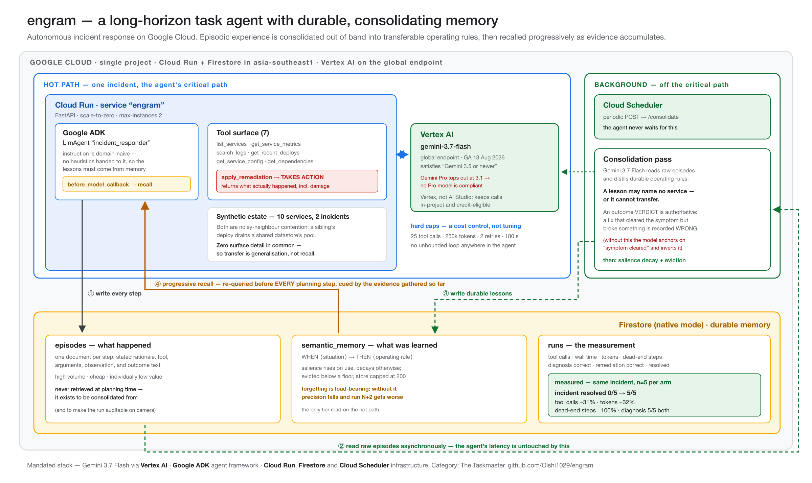

# engram

**A long-horizon task agent with durable, consolidating memory.**

An autonomous incident-response agent that investigates a production outage, **takes action**, records
what it learned, consolidates that experience into transferable operating rules in the background,
and then handles a *different* incident measurably better because of it.

> Built for the [All Things Agentic Hackathon](https://allthingsagentichackathon.devpost.com/)
> (Google Cloud, August 2026). Category: **The Taskmaster**.
> Live: **https://engram-921012904912.asia-southeast1.run.app**



---

## The result

Same incident, five trials per arm. The only variable is whether memory is enabled.

| metric | COLD (no memory) | WARM (memory) | Δ |
|---|---|---|---|
| **incident fully resolved** | **0 / 5** | **5 / 5** | — |
| remediation chosen | `rollback_deploy` ×5 | `reduce_client_pool_in_place` ×5 | — |
| tool calls | 12.8 ± 3.8 | 8.8 ± 0.8 | **−31 %** |
| wall seconds | 45.0 ± 9.7 | 32.5 ± 3.0 | −28 % |
| total tokens | 36,475 ± 12,844 | 24,628 ± 2,285 | −32 % |
| steps spent on the red herring | 0.4 | 0.0 | −100 % |
| root cause diagnosed correctly | 5 / 5 | 5 / 5 | — |

Full protocol, caveats and raw trial data: [`results/benchmark-2026-08-26.md`](results/benchmark-2026-08-26.md).

### Reading that table honestly

**Diagnosis is 5/5 in both arms.** Gemini 3.7 Flash finds the root cause reliably with no memory at
all. Any claim that memory helps it *find* the answer would be overstated — the honest
search-efficiency result is −31 % on steps, and a much larger collapse in variance (±3.8 → ±0.8).

**The categorical result is the remediation**, and it comes from a deliberate design decision.

Every fact needed to *diagnose* the incident is present in the environment, so a capable model can
always recover it. Memory could only ever save it a few search steps. So the agent is also required
to **choose and apply a fix** — and which fix is correct is *not* in the environment:

* `rollback_deploy` clears the symptom **and terminates an in-flight job** that must restart from zero.
* `reduce_client_pool_in_place` clears it just as fast and lets the job finish.

Nothing in the metrics, logs, configs or topology distinguishes them. The cold agent chose rollback
5/5 — the textbook instinct — destroying a 4.8 M-recipient campaign send every time. The warm agent
chose the in-place fix 5/5, having learned from **one prior incident on entirely different services**
what the rollback cost.

That is the claim: **memory is not a faster index over what the agent could already work out. It is
the only route to knowledge the environment never exposes.**

---

## Mandated stack

| Requirement | This project |
|---|---|
| Gemini 3.5 or newer, via Gemini API or Vertex AI | **`gemini-3.7-flash` on Vertex AI**, global endpoint |
| At least one Google agent framework | **Google ADK** (`LlmAgent`, tools, `before_model_callback`) |
| At least one Google Cloud infrastructure service | **Cloud Run**, **Firestore** (native mode), **Cloud Scheduler** |

> ⚠️ A note that cost us time and may save you some: **the Gemini *Pro* line tops out at 3.1 on
> Vertex AI as of August 2026**, so no Pro model satisfies "Gemini 3.5 or newer". The Flash family is
> the compliant choice. Vertex is used rather than the Gemini API in AI Studio so that every call
> stays inside the project and remains eligible for Google Cloud credit.

---

## How it works

### Two memory tiers, not one log

The common shape for "an agent with memory" is: log everything, then search the log. That is a
transcript, and it gets *worse* as it grows — pulling five useful items out of ten thousand raw
events is harder than pulling them out of fifty distilled lessons.

* **`episodes`** — one document per step: the agent's stated rationale, the tool, its arguments, the
  observation, and any outcome. High volume, cheap, individually low value. **Never retrieved at
  planning time.** It exists to be consolidated *from*.
* **`semantic_memory`** — `WHEN ⟨situation⟩ → THEN ⟨operating rule⟩`. Low volume, expensive to
  produce, individually high value. The only tier read on the hot path.

### Consolidation runs out of band

Cloud Scheduler POSTs to `/consolidate`; Gemini reads raw episodes and distils durable rules. The
agent never waits for it. That is the architectural position: **working out what an experience
*meant* should not be paid for while still handling the incident.**

The single instruction that matters is that **a lesson may not name a service.** A lesson about
`redis-session` on `checkout-api` is useless on a Postgres incident in the search path. A lesson
about *deploys that raise concurrency without raising the pool* transfers.

### Retrieval is progressive

Memory is re-queried **before every planning step**, cued by the evidence gathered so far — not once
from the initial alert. This matters more than it sounds: consolidated lessons are phrased in the
vocabulary of *evidence* ("shared datastore", "pool exhausted"), none of which exists in an alert
that says "search latency spiked to 5.4 s". Retrieving once up front measured a 10 % improvement,
inside the noise. See [Engineering notes](#engineering-notes).

### Forgetting is load-bearing

Each lesson carries a salience score that rises when it contributes to a resolved incident and
decays otherwise; below a floor it is evicted, and the store is capped. Without this the semantic
tier grows without bound, retrieval precision falls, and run *N+2* becomes worse than run *N+1* —
which would falsify the whole claim. **A memory system that cannot forget is one that degrades.**

---

## Reproducible Testing

Everything below runs against your own Google Cloud project. Total time ≈ 15 minutes.

### 0. Prerequisites

* Python **3.12+**
* [`gcloud` CLI](https://cloud.google.com/sdk/docs/install), authenticated
* A Google Cloud project with **billing enabled** (the free trial is sufficient)

### 1. Clone and install

```bash
git clone https://github.com/Oishi1029/engram.git
cd engram
python3 -m venv .venv && source .venv/bin/activate
pip install -r requirements.txt
```

### 2. Authenticate and configure

```bash
gcloud auth login
gcloud auth application-default login
gcloud config set project YOUR_PROJECT_ID
gcloud auth application-default set-quota-project YOUR_PROJECT_ID
```

### 3. Enable the APIs

```bash
gcloud services enable aiplatform.googleapis.com firestore.googleapis.com run.googleapis.com cloudbuild.googleapis.com artifactregistry.googleapis.com cloudscheduler.googleapis.com
```

### 4. Create the Firestore database

```bash
gcloud firestore databases create --location=asia-southeast1 --type=firestore-native
```

> The location is **permanent** and cannot be changed later. Pick the region nearest you.

### 5. Set the environment

```bash
export GOOGLE_CLOUD_PROJECT=YOUR_PROJECT_ID
export GOOGLE_CLOUD_LOCATION=global
export GOOGLE_GENAI_USE_VERTEXAI=TRUE
```

### 6. Run the tests

**a. Offline — no cloud account, no cost, half a second.** Asserts the project's central property:
a lesson learned on INC-001 must retrieve on the unseen INC-002, above deliberately
high-salience distractor lessons about unrelated failure modes.

```bash
python tests/test_retrieval_transfer.py
```

**b. A single incident, end to end.**

```bash
python scripts/run_one.py INC-002 --no-memory
```

**c. The full demonstration** — cold baseline → learn from a *different* incident → consolidate →
warm re-run, with a comparison table. ≈ 3 minutes, ≈ $0.05.

```bash
python scripts/demo.py
```

**d. The benchmark that produced the table above** — 5 trials per arm. ≈ 12 minutes, ≈ $0.25.

```bash
python scripts/benchmark.py -n 5
```

### 7. Deploy it

```bash
gcloud run deploy engram --source . --region asia-southeast1 --allow-unauthenticated \
  --max-instances 2 --memory 1Gi --timeout 300 \
  --set-env-vars "GOOGLE_CLOUD_PROJECT=YOUR_PROJECT_ID,GOOGLE_CLOUD_LOCATION=global,GOOGLE_GENAI_USE_VERTEXAI=TRUE"
```

> **If the deploy fails with a Cloud Storage `403`**, new Google Cloud projects no longer grant the
> default compute service account the roles a source deploy needs. This fixes it:
>
> ```bash
> PROJECT=YOUR_PROJECT_ID
> NUM=$(gcloud projects describe $PROJECT --format='value(projectNumber)')
> for ROLE in roles/cloudbuild.builds.builder roles/storage.objectViewer roles/artifactregistry.writer roles/logging.logWriter roles/aiplatform.user roles/datastore.user; do
>   gcloud projects add-iam-policy-binding $PROJECT --member="serviceAccount:${NUM}-compute@developer.gserviceaccount.com" --role="$ROLE" --condition=None
> done
> ```
>
> The last two are *runtime* roles — without them the container deploys successfully and then fails
> on its first Vertex AI or Firestore call.

### 8. Schedule background consolidation

```bash
gcloud scheduler jobs create http engram-consolidate --location=asia-southeast1 \
  --schedule="*/30 * * * *" --uri="$(gcloud run services describe engram --region asia-southeast1 --format='value(status.url)')/consolidate" \
  --http-method=POST --headers=Content-Type=application/json --message-body='{}'
```

### HTTP surface

| Route | Purpose |
|---|---|
| `GET /` | Live view of semantic memory and recent runs |
| `POST /run` | `{"incident_id": "INC-002", "use_memory": true}` |
| `POST /consolidate` | `{"run_ids": [...]}` — driven by Cloud Scheduler |
| `GET /memory` | Consolidated lessons with salience |
| `GET /runs` | Recent run records |
| `GET /health` | Health check |

---

## Engineering notes

Four defects surfaced while building this. **Every one reported a plausible number rather than an
error**, and each would have shipped as "memory doesn't help much":

1. **Consolidation learned the exact opposite lesson.** Given a rollback whose outcome opened
   "cleared within 90 seconds" and then described a destroyed job, the model anchored on the
   success, recommended rollback as correct, and *fabricated a mechanism* for why the genuinely
   correct fix would be harmful. A confidently wrong lesson is worse than no memory, because it is
   retrieved and trusted. Fixed by leading outcome reports with an explicit **VERDICT**, as a real
   postmortem does, and telling the consolidation prompt that a verdict is authoritative.
2. **An off-by-one silently corrupted every episodic record.** A tool call and its result arrive in
   *separate* ADK events; episodes were written on the call, so each recorded the **previous**
   step's observation. The final `apply_remediation` outcome — the only knowledge here that cannot
   be deduced — was never captured at all.
3. **The experimental-hygiene filter discarded the data it existed to protect.** Consolidation was
   restricted by run id, but the limit was applied *before* the filter, so most of the teaching run
   fell outside the window. It reported "consolidated 7 episodes" on a 12-step run and survived two
   full benchmark runs looking normal.
4. **Retrieval fired once, at the only moment it could not work** (see *Retrieval is progressive*).

Three guards exist to keep the result honest, and none may be traded away for a bigger number:

* The agent's system prompt is **domain-naive** — it is never told that deploys are prime suspects
  or that a degraded dependency may be a symptom. Those are exactly the lessons memory must supply.
  Crippling the memoryless agent would manufacture a large delta and a worthless number.
* **Consolidation never sees the control arm's episodes**, or the warm run would learn the answer to
  its own measurement.
* **The teaching incident shares no surface detail with the test incident** — different service,
  datastore, culprit and red herring. Otherwise it is recall, not generalisation.

---

## Repository layout

```
engram/
├── engram/
│   ├── agent.py              ADK LlmAgent; the domain-naive instruction
│   ├── runner.py             one instrumented run, hard caps, grading
│   ├── server.py             Cloud Run service
│   ├── config.py             model IDs and the safety caps
│   ├── env/
│   │   ├── fixtures.py       synthetic estate, 2 incidents, remediation outcomes
│   │   └── tools.py          the 7 tools, incl. apply_remediation
│   └── memory/
│       ├── records.py        pure dataclasses, no cloud dependency
│       ├── store.py          Firestore: episodes, semantic_memory, runs
│       ├── retrieval.py      lexical scoring, salience-weighted
│       ├── progressive.py    re-retrieval before every planning step
│       └── consolidate.py    episodes → durable operating rules
├── scripts/                  run_one · demo · benchmark
├── tests/                    the offline transfer test
├── results/                  benchmark data
└── docs/architecture.{svg,png,pdf}
```

**On synthetic data:** the estate, services, incidents and logs are entirely fabricated. No real
system, customer or person is represented anywhere in this repository or in the demo video.

---

## Pre-existing work disclosure

This project was newly created during the Submission Period (3–31 August 2026); every commit in this
repository falls inside that window. Its memory architecture was informed by my own prior
open-source project [`instar`](https://github.com/Oishi1029/instar), which is disclosed here as
pre-existing work of mine. **No source code from that project was copied into this one.** AI coding
assistants were used throughout development, as expressly permitted by the Contest Rules.

## Licence

MIT — see [LICENSE](LICENSE).
